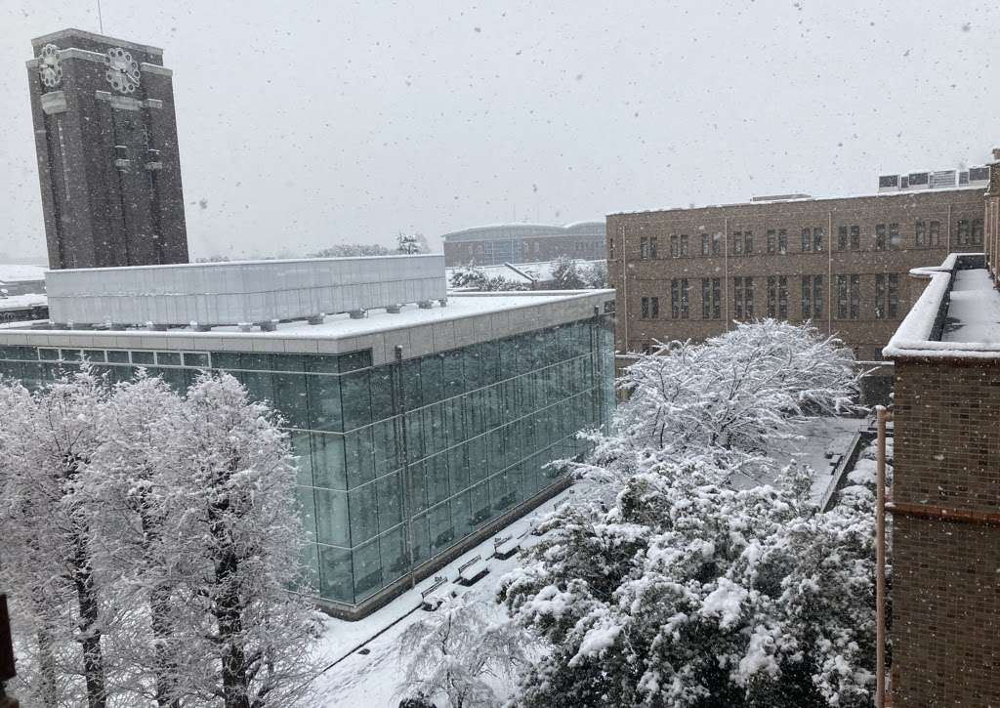

I received my Ph.D. in Political Science from Kyoto University in 2019. From 2021, I am an associate professor of Political Science at Kyoto University.

My research focuses on political parties, legislative behavior, and Japanese politics. It has been published in Electoral Studies, Legislative Studies Quarterly, Journal of Election, Public Opinion and Parties, and Social Science Japan Journal.

Please find my detailed [CV](cv.pdf).

