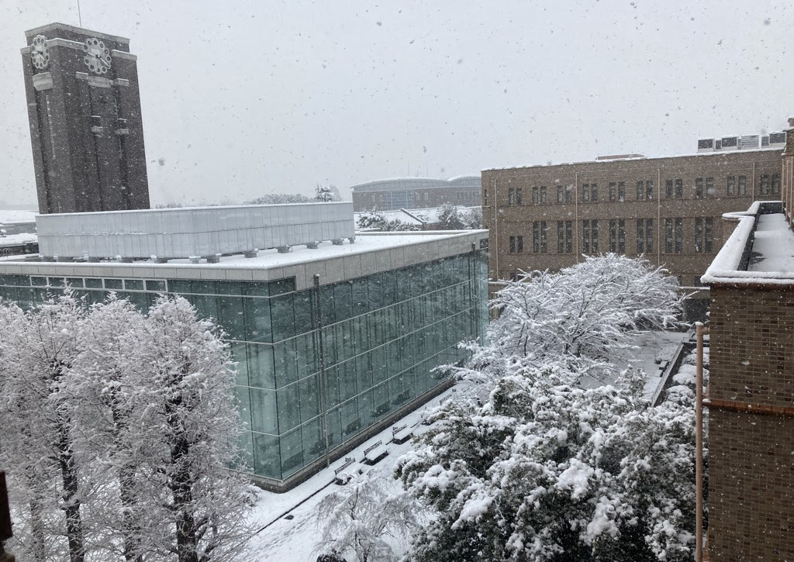

I received my PhD in Political Science from Kyoto University in 2019. Since 2021, I have been an Associate Professor of Political Science at Kyoto University.

My research focuses on political parties, legislative behavior, and Japanese politics.
I am also interested in applying machine learning methods to political science, including text-as-data, audio-as-data, and visual analysis.
My work has been published in Electoral Studies, Legislative Studies Quarterly, Journal of Elections, Public Opinion and Parties, Representation, and Social Science Japan Journal.

Please find my detailed [CV](cv_sept26.pdf).

